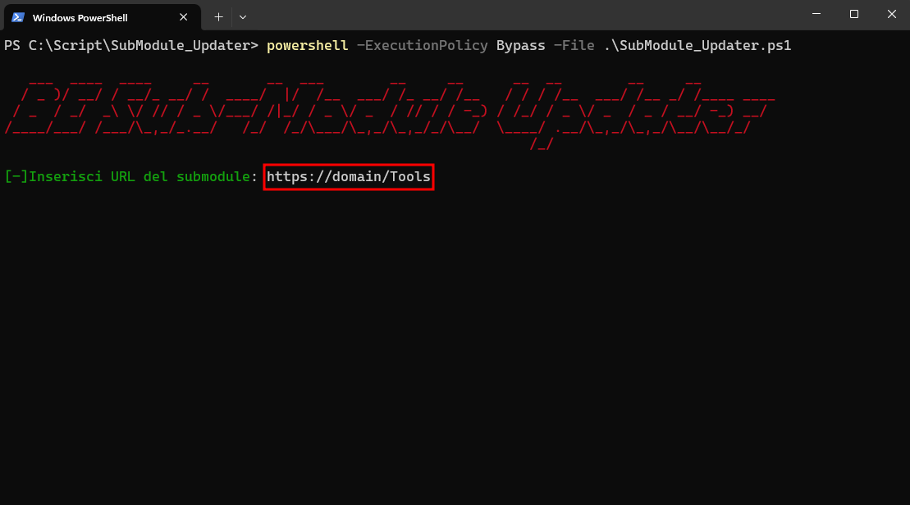
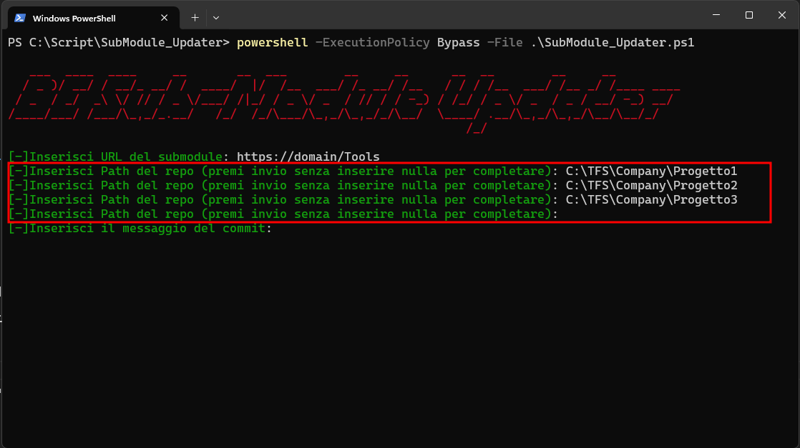

# SubModule_Updater

  

## Descrizione

Questo script serve per aggiornare lo stesso ***submodule*** su piu' repositories diversi.
Questo script ***aggiorna*** il submodule nei repo, ed esegue un ***push*** delle modifiche direttamete sul repository.

## Download & Esecuzione

Per scaricare il repo e lanciare lo script bisogna aprire un ***cmd*** o una ***powershell*** e eseguire i seguenti comandi:

```bash

git clone https://github.com/gabriele-annese/SubModule_Updater.git

```

```bash

cd .\SubModule_Updater

```
Lo script non è ***firmato digitalmente***, quindi per evitare errori di esecuzione bisogna lanciare lo script in questo modo 

```bash

powershell -ExecutionPolicy Bypass -File .\SubModule_Updater.ps1

```
## Funzionamento

Una volta lanciato lo script verranno chieste 3 cose:

* Inserire l'***URL*** del submdoule da aggiornare 

    

* Inserire la lista delle ***Path*** locali dei repo su cui si vuole aggiornare il submodule.

    Una volta inserte tutte le path lasciare vuoto l'ultimo inserimento e premere invio
    

* inserire un ***Commento*** per il commit 

    
